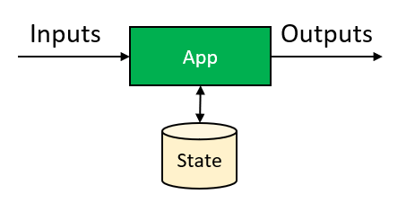
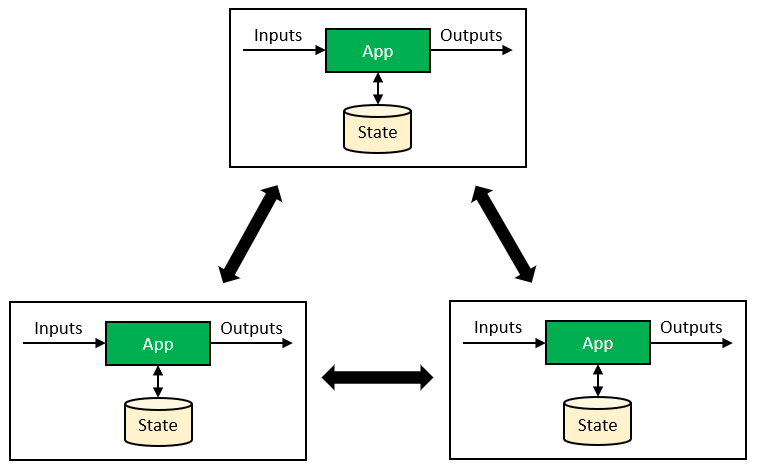
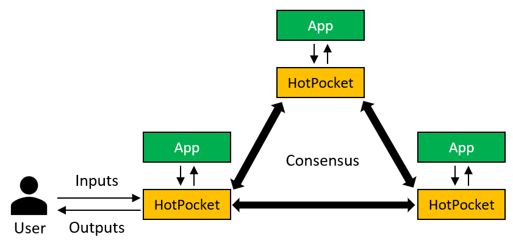
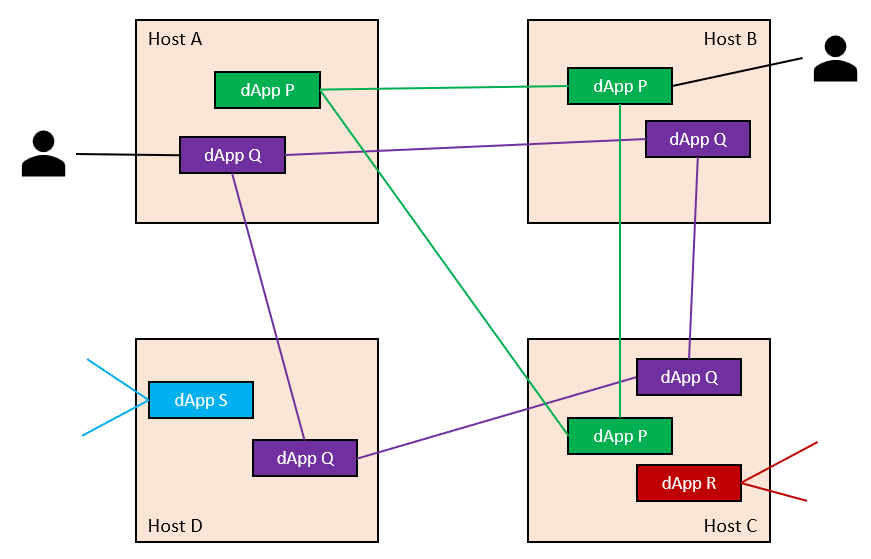

# Evernode platform overview

## Apps vs DApps

We can think of an app as something that can process **Inputs** and produce **Outputs** while reading/updating **State**. Many traditional apps fall into this category and they can be implemented with many programming languages and platforms on the market.

We can make a **decentralized** app (DApp a.k.a smart contract) by making multiple instances of the app work together in unison to process inputs, state and produce outputs. There is no single (central) party to coordinate instances. All app instances are equal and perform the same job. The app instances verify with each other that what they are processing is consistent and similar across all instances so they individually produce the same result.

The process of communicating and verifying each others behavior and agreeing upon the correct results is called **Consensus**. There is no leader/coordinator to conduct this process. Every app instance must perform this activity individually. HotPocket provides this ability to your app in order to make it a "decentralized" app.

## HotPocket consensus engine - for decentralized apps

[HotPocket](hotpocket/overview) is a consensus engine which helps decentralize POSIX-compliant apps written in traditional programming platforms. In HotPocket terminology, each application instance is a "**node**". Each node contains a copy of the HotPocket software and your application. Your app contains the application logic and some integration points that can be used by HotPocket to control and communicate with it. See [tutorials](https://github.com/EvernodeXRPL/evernode-sdk#tutorials) on how to create HotPocket DApps.

- Users interacts with HotPocket via WebSockets in order to communicate with your app.

- HotPocket takes care of the consensus process with other HotPocket nodes via WebSockets.

- Your app is free to do anything a POSIX application software can do.

  - You can connect to internet and interact with other web services.
  - You can use any conventional application frameworks/libraries in your app.
  - You can use the filesystem (or file-based databases) for data persistence. HotPocket treats the filesystem as "state".
  - You have full control over raw binary data of user Inputs and Outputs.

## Decentralized infrastructure

HotPocket enables you to create decentralized apps. In order to run them you need multiple machines/hardware to host your DApp nodes. Ideally, DApp infrastructure also needs to be decentralized so the DApp nodes are not controlled/owned by a single party. Evernode provides the **decentralized infrastructure** required for this. It is a [decentralized marketplace](https://dashboard.evernode.org) in which hosting resources can be provisioned and used by your HotPocket DApps.

Evernode uses a set of [XRPL hooks](hooks/overview) to coordinate its decentralized marketplace activities. **Hosts** can register themselves on the marketplace by installing [Sashimono](sashimono/overview) on their Linux servers. **Tenants** can lease DApp hosting resources from any of the hosts using **Evers** (Evernode's native currency - EVR). Each leased hosting instance is a HotPocket node. The tenant deploys their DApp files into the HotPocket node. Leasing and deploying into multiple such HotPocket nodes creates a DApp cluster.

- Evernode **Hosts** and **Tenants** are represented by Xahau accounts.
- Marketplace information and rules are goverened by [XRPL hooks](https://hooks.xrpl.org/).
- Marketplace operations (host registration, leasing etc...) are represented by Xahau transactions.
- A single host can make many DApp nodes available for lease using its hardware resources.
- DApp operations (deployment, consensus, user interaction) happen directly between HotPocket nodes and users via WebSockets. They are NOT dependent on the Xahau network. They simply use the network "ports" allocated by the Host (Read [more](https://github.com/EvernodeXRPL/evernode-host#firewalls-and-ports)).

The following diagram shows how different HotPocket DApps would be distributed across many Evernode hosts. Each DApp forms its own mesh network.

See [here](../hosts/evernode-host.md) on how to become an Evernode Host.