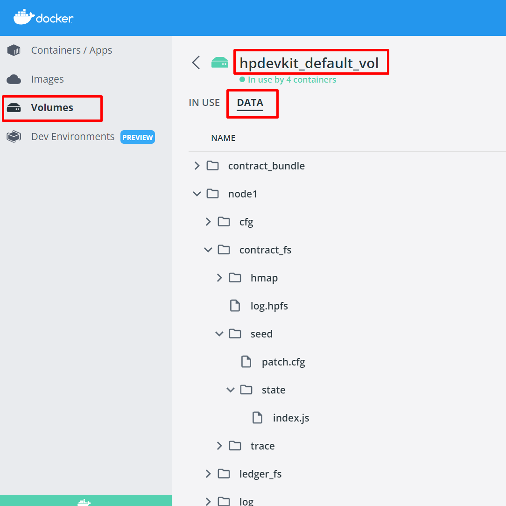

# Getting started with DApp development

## HotPocket developer kit (hpdevkit)
Evernode uses HotPocket as its smart contract engine. HotPocket smart contracts can be developed using any POSIX-compliant language/framework. Using the HotPocket developer kit, you can easily develop and test HotPocket smart contracts on your local PC for free.

**_Throughout our documentation we may use the terms “DApp”, “smart contract” or “contract” due to historical reasons. They all mean the same thing._**

## Installation

### Prerequisites

The HotPocket developer kit requires you to install [Docker Engine](https://docs.docker.com/engine/install/) and [NodeJs](https://nodejs.org/en/) on your development machine.

### Cross-platform support

The HotPocket developer kit is a [global npm package](https://www.npmjs.com/package/hpdevkit) that supports both Linux and Windows operating systems.

1. Install [prerequisites](#prerequisites).
2. Run the following command to install hpdevkit on your machine:
   ```
   npm i hpdevkit -g
   ```

_**NOTE:** In Linux platforms, installation requires root privileges. Hence, add `sudo` to the above command.
Final contract bundles are deployed and run in Linux environment. Binary outputs built-in Windows environments might cause errors. Hence the recommended development platform is Linux_

## Creating a HotPocket smart contract

You can use the HotPocket developer kit to generate smart contract projects such that everything is pre-configured. Here, we are creating a NodeJs smart contract (This assumes you have prior experience with developing NodeJs applications):

```
hpdevkit gen nodejs starter-contract myproj
cd myproj
npm install
npm start
```

The 'npm start' command will build and deploy the NodeJs smart contract into a HotPocket cluster running on your machine. It will also start printing the console output from the HotPocket instance. You can press Ctrl+C at any time to exit from monitoring the HotPocket console output. However, the HotPocket instance will continue to run even after you exit the monitoring console.

### Viewing logs

You can re-enter the monitoring console with the command `hpdevkit logs 1`, where `1` is the HotPocket instance number you wish to monitor.

### Changing the cluster size

In order to resize the HotPocket cluster, you need to delete and re-create it:

_**NOTE:** This will delete the running app cluster. you will lose the app data._

1. Delete the existing cluster using the `hpdevkit clean` command.
2. Set the HP_CLUSTER_SIZE environment variable to the size you want.

   ```
   # Windows (command prompt)
   set HP_CLUSTER_SIZE=5

   # Windows (powershell)
   $env:HP_CLUSTER_SIZE=5

   # Linux (bash)
   export HP_CLUSTER_SIZE=5
   ```

3. Deploy your contract again with `npm start`.

## Creating HotPocket client application

You can use the HotPocket developer kit to generate a HotPocket client application such that everything is pre-configured. Here, we are creating a NodeJs client (This assumes you have prior experience with developing NodeJs applications):

```
hpdevkit gen nodejs blank-client myclient
cd myclient
npm install
node myclient.js
```

This will start the client application and connect a HotPocket node listening to port 8081. Also, note that you need to have HotPocket nodes running on your machine for the client to connect.

## Listing available code templates

You can use the `hpdevkit list` command to list all available comtract and client code templates. 

```
hpdevkit list <platform>
```
- `<platform>` is an optional parameter that can be used to filter code templates based on the platform they are designed for.

## Deploying contract files directory to the cluster

You can use the `hpdevkit deploy` command to deploy a specified contract file directory to a HotPocket cluster.

```
hpdevkit deploy <contract-files-directory>
```
- `<contract-files-directory>` should contain the path of the contract directory to be deployed.
- The following options can be specified with this command:

  | Name                              | Description                         |
  | --------------------------------- | ----------------------------------- |
  | `-m, --multi-sig [multi-sig]`     | Multi-signing enabled.            |
  | `-a, --master-addr [master-addr]` | Master address for multi-signing. |
  | `-s, --master-sec [master-sec]`   | Master secret for multi-signing.  |


## Advanced usage

```
# Stop and clean-up everything (required for changing cluster size)
hpdevkit clean

# View a specific node's logs
hpdevkit logs <node number>

# Start/stop all nodes
hpdevkit start
hpdevkit stop

# Start/stop a specific node
hpdevkit start <node number>
hpdevkit stop <node number>

# Add a new node to the cluster
# (The new node will use the existing UNL and become an observer node)
hpdevkit spawn
```

If the contract files directory also contains a file named `hp.cfg.override`, it will be used to override the hp.cfg of all nodes. This can be used to set contract-specific parameters like 'bin_path' and 'bin_args'

An example `hp.cfg.override` file for a NodeJs application (the HotPocket developer kit NodeJs starter contract automatically includes this file for you):

```
{
    "contract": {
        "bin_path": "/usr/bin/node",
        "bin_args": "app.js"
    }
}
```

### Inspect contract files of all nodes

You can inspect the files of all the nodes of the cluster using Docker Desktop.


## Environment variables

`hpdevkit` CLI supports the following environment variables, all of which are optional:

| Name                   | Description                                                                                                                                                | Default value                                |
| ---------------------- | ---------------------------------------------------------------------------------------------------------------------------------------------------------- | -------------------------------------------- |
| HP_CLUSTER_SIZE        | The number of nodes in the cluster. This only takes effect with a fresh cluster.                                                                           | `3`                                          |
| HP_DEFAULT_NODE        | The node which the 'deploy' command uses to display logs.                                                                                                  | `1`                                          |
| HP_DEVKIT_IMAGE        | The Docker image to be used for devkit cluster management.                                                                                                 | `evernode/hpdevkit`                          |
| HP_INSTANCE_IMAGE      | The Docker image to be used for HotPocket instances.                                                                                                       | `evernode/hotpocket:latest-ubt.20.04-njs.20` |
| HP_USER_PORT_BEGIN     | The starting user port number for the cluster.                                                                                                             | `8081`                                       |
| HP_PEER_PORT_BEGIN     | The starting peer port number for the cluster.                                                                                                             | `22861`                                      |
| HP_EV_NETWORK          | Evernode network to be used. This is only for Xahau transaction contracts.                                                                      | `mainnet`                                    |
| HP_MULTI_SIGNER_WEIGHT | Multi signer weight for each cluster node's signer account. This is only for Xahau transaction contracts.                                       | `1`                                          |
| HP_MULTI_SIGNER_QUORUM | Multi signer quorum ([0-1] - Percentage of total weights) for each cluster node's signer account. This is only for Xahau transaction contracts. | `0.8`                                        |

## Updates

Run one of the following commands to update `hpdevkit` to the latest version, and update the supporting docker images:

- Using hpdevkit CLI

  ```
  hpdevkit update
  ```

- Using npm
  ```
  npm update hpdevkit -g
  ```

**NOTE: You need to re-deploy your contracts for the new changes to take effect.**

## Uninstall

Run the following command to uninstall `hpdevkit` and the supporting docker images and containers:

- Using hpdevkit CLI
  ```
  hpdevkit uninstall
  ```

**NOTE: Uninstalling from hpdevkit CLI is recommended. If you uninstall using npm, you will have to clean the hpdevkit supporting docker images and containers manually.**

_**NOTE:** In Linux platforms, you will need root privileges to execute updates and uninstallations. Hence, add `sudo` to the above commands._

## Reporting issues

Report issues [here](https://github.com/EvernodeXRPL/evernode-sdk/issues).

## Continue reading
HotPocket [Concepts](../../../platform/hotpocket/index).

HotPocket SDK [Basics](../tutorials/basics.md).

Deploy your locally developed DApp in evernode using [evdevkit](../../evernode/index).